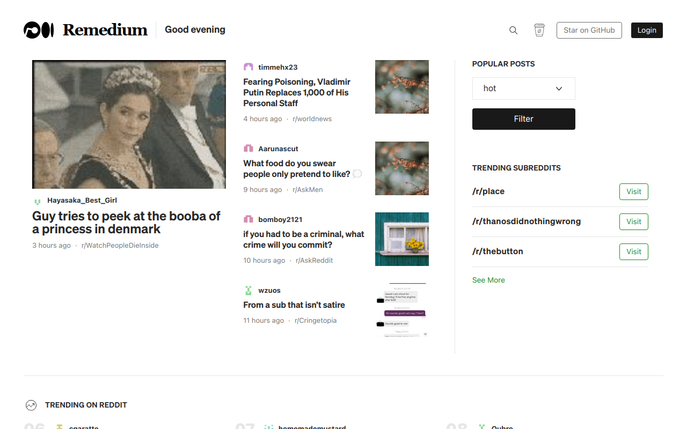

<h3 align="center"></h3>

DEMO: [remedium.vercel.app](https://remedium.vercel.app)

Remedium is a Medium-themed Reddit client. No longer worry about being judged while browsing Reddit in public. The Remedium interface converts Reddit posts, discussions, and memes into well-crafted articles. Once remote work is over, Remedium will be the perfect site to visit during your commute.

Built with Next.js, TailwindCSS, and hosted on Vercel. Reddium is built with optimization in mind, making use of Next.js 10's analytics and server-side rendering. Placeholder images are obtained from [Unsplash](https://unsplash.com), and avatars are generated from [thispersondoesnotexist.com](https://thispersondoesnotexist.com/). Remedium is still under development.

## Functionality

- Browse subreddits, posts, and comments in the Medium interface
- Search Reddit through the Medium search interface
- Visit user profiles
- Quality of life features to recreate the Reddit experience as closely as possible (WIP)
- Login with Reddit to view your personal subscriptions in Remedium (Planned)

## Contribute

1. Clone the repository to your local machine. 
2. Install all packages. 
```
$ npm i
```
3. Start the development server. 
```
$ npm run dev
```
4. Make a pull request
